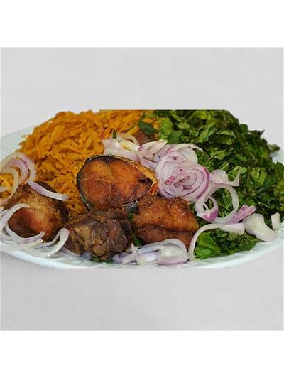
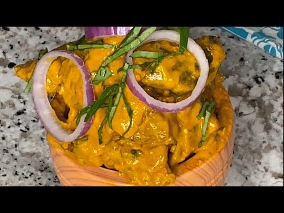
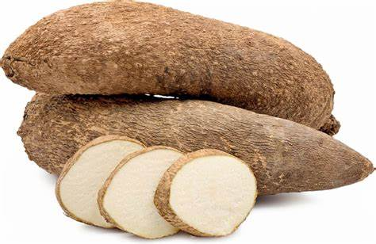
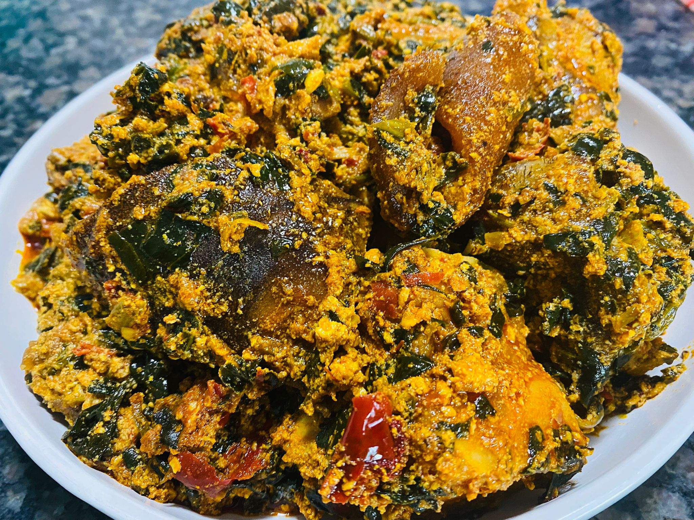

# Igbo Food Image Classification using Deep Learning

This project presents a deep learning-based system for classifying traditional Igbo cuisine using computer vision models. The research focuses on building an AI model capable of recognizing culturally specific African dishes, which are often underrepresented in global food datasets.

The project introduces a custom Igbo food image dataset and evaluates multiple convolutional neural network (CNN) architectures to determine the most effective model for classification.

---

## Project Motivation

Most food recognition datasets focus on Western or Asian cuisines, leaving African culinary traditions underrepresented in AI systems.

This project aims to address that gap by:

- Creating a dataset of traditional **Igbo food images**
- Training deep learning models to recognize these dishes
- Promoting **cultural inclusivity in artificial intelligence**

The project demonstrates how AI can contribute to **digital preservation of cultural heritage**.

---

## Dataset

A custom dataset was created specifically for this research.

Dataset characteristics:

- **2000 images**
- **20 traditional Igbo dishes**
- **100 images per class**
- Images resized to **224 x 224 pixels**

Each image also includes **metadata**, such as:

- Food name
- Ingredients
- Region of origin
- Cultural significance

This metadata enables richer interpretation of model predictions.

Example food classes include:

- Abacha
- Akpu
- Egusi Soup
- Oha Soup
- Ji Yam
- Nkwobi
- Moi Moi
- Yam Porridge
- Okpa
- Osikapa

---

## Data Preprocessing

Several preprocessing steps were applied before model training:

- Image resizing to 224x224
- Image normalization using ImageNet statistics
- Data augmentation
  - Random horizontal flips
  - Small rotations
  - Brightness adjustments
- Train / validation split (80% / 20%)

These techniques improve model generalization and reduce overfitting.

---

## Deep Learning Models

Three convolutional neural network architectures were implemented and compared.

### 1. Custom CNN

A lightweight convolutional neural network designed from scratch.

Architecture features:

- 3 convolutional layers
- ReLU activation
- Max pooling
- Dropout layers
- Fully connected classification layer

This model provides a computationally efficient baseline.

---

### 2. EfficientNetB0 (Transfer Learning)

EfficientNetB0 was used with pretrained ImageNet weights.

Approach:

- Freeze feature extraction layers
- Fine-tune the classification head
- Transfer learning improves performance on small datasets

EfficientNetB0 achieved the **highest performance** among the tested models.

---

### 3. ResNet18 (Transfer Learning)

ResNet18 is a widely used deep CNN architecture.

Implementation:

- Pretrained ImageNet weights
- Final classification layer replaced for 20 classes
- Fine-tuned on the Igbo food dataset

ResNet18 achieved strong performance while maintaining relatively fast training time.

---

## Training Setup

Training environment:

- Python
- PyTorch
- Google Colab (GPU acceleration)

Training configuration:

- Batch size: 32
- Maximum epochs: 30
- Early stopping enabled
- Adam optimizer
- CrossEntropy loss function

Learning rate scheduling was used to improve convergence.

---

## Evaluation Metrics

Model performance was evaluated using multiple metrics:

- Accuracy
- Precision
- Recall
- F1 Score
- Confusion Matrix
- ROC Curves
- Precision-Recall Curves

Top-3 prediction accuracy was also evaluated to simulate real-world recognition systems.

---

## Results

| Model | Validation Accuracy | Macro F1 Score |
|------|------|------|
| EfficientNetB0 | **76%** | 76% |
| ResNet18 | 74% | 74% |
| Custom CNN | 70% | 70% |

Key observations:

- EfficientNetB0 achieved the best performance.
- Transfer learning significantly improved classification accuracy.
- The custom CNN performed well despite having a simpler architecture.

Some dishes with visually similar features (e.g., soups) were harder to distinguish.

---

## Explainable AI (Grad-CAM)

To improve model transparency, **Grad-CAM (Gradient-weighted Class Activation Mapping)** was applied.

Grad-CAM visualizations highlight the regions of the image that influenced the model’s predictions.

This improves:

- Model interpretability
- Trust in AI predictions
- Understanding of classification behavior

Explainability is especially important for culturally sensitive datasets.

---

## Sample Dataset Images

| Abacha | Isi Ewu | Ji Yam | Ofe Egusi |
|------|------|------|------|
|  |  |  |  |

## Technologies Used

- Python
- PyTorch
- Torchvision
- Scikit-learn
- Pandas
- NumPy
- Matplotlib
- Google Colab

---
## Research Contributions

This project contributes to the AI research community by:

- Introducing one of the first **Igbo food image datasets**
- Demonstrating deep learning applications for **African cuisine recognition**
- Promoting **cultural representation in AI systems**

The research highlights the importance of building **globally inclusive AI datasets**.

---

## Future Work

Possible improvements include:

- Expanding the dataset with more African dishes
- Integrating metadata directly into the model
- Deploying the model as a **mobile food recognition app**
- Applying more advanced architectures (e.g., Vision Transformers)
